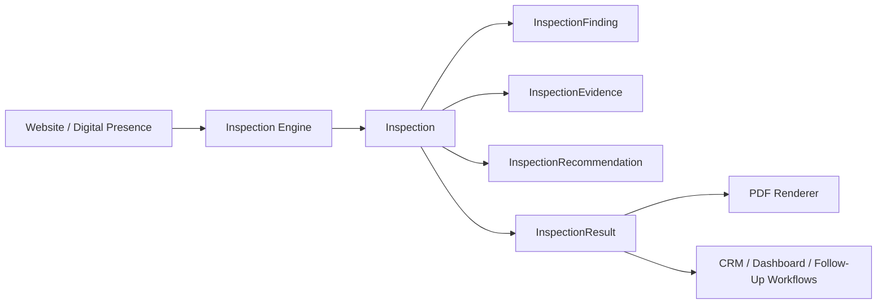
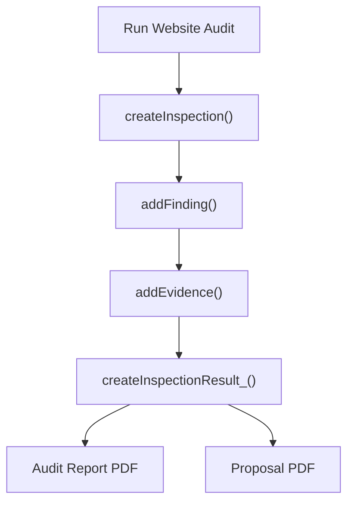

# Rogers Holdings OS Inspection Engine

Date: 2026-06-28

Status: Initial architecture module. Existing audit scoring, PDF generation, Gmail workflows, Drive routing, dashboards, menus, branding, and sheet structure are unchanged.

## Purpose

The Inspection Engine separates inspection from report generation.

Current state:

- Existing audit workflows still produce audit data and PDFs the same way.
- `PdfEngine.gs` remains the presentation layer.
- `InspectionEngine.gs` introduces reusable objects and helpers for future structured inspections.

Target state:

1. Inspection Engine discovers findings.
2. Inspection Engine collects evidence.
3. Inspection Engine assigns severity, priority, difficulty, and expected ROI.
4. Inspection Engine produces structured observations and recommendations.
5. PDF renderer consumes `InspectionResult` and renders the presentation.

## Architecture

The first version is intentionally non-invasive. No current workflow calls the Inspection Engine yet.

## Objects

### Inspection

The top-level inspection record.

Fields:

- `objectType`
- `id`
- `version`
- `createdAt`
- `updatedAt`
- `company`
- `website`
- `city`
- `state`
- `industry`
- `source`
- `status`
- `categories`
- `findings`
- `evidence`
- `recommendations`
- `score`
- `priorityMatrix`
- `businessSummary`
- `inspectorNotes`
- `aiNotes`
- `metadata`

### InspectionCategory

Reusable category definition.

Initial categories:

- Contact Information
- Trust Signals
- Calls To Action
- Homepage
- Navigation
- Local SEO
- Google Business
- Performance
- Accessibility
- Content Quality
- Brand Consistency
- Lead Capture
- Analytics
- Security

### InspectionFinding

Structured finding object.

Fields:

- `id`
- `category`
- `title`
- `description`
- `severity`
- `priority`
- `status`
- `evidence`
- `businessImpact`
- `customerImpact`
- `recommendation`
- `difficulty`
- `expectedRoi`
- `inspectorNotes`
- `aiNotes`

### InspectionEvidence

Evidence object designed for screenshots, text, metrics, Search/GBP/PageSpeed data, or future AI-populated proof.

Fields:

- `id`
- `type`
- `source`
- `sourceUrl`
- `label`
- `description`
- `value`
- `screenshotUrl`
- `screenshotDataUri`
- `annotations`
- `capturedAt`
- `confidence`
- `metadata`

### InspectionRecommendation

Recommended action tied to a finding or inspection.

Fields:

- `id`
- `summary`
- `action`
- `rationale`
- `expectedOutcome`
- `owner`
- `timeframe`
- `metadata`

### InspectionResult

Final structured result intended for future rendering and workflow handoff.

Fields:

- `inspectionId`
- `company`
- `website`
- `score`
- `status`
- `summary`
- `findings`
- `evidence`
- `recommendations`
- `generatedAt`
- `metadata`

## Helper Functions

Public helpers:

- `createInspection(input)`
- `addFinding(inspection, findingInput)`
- `addEvidence(target, evidenceInput)`
- `calculateInspectionScore(inspection)`
- `getPriorityMatrix()`
- `getBusinessSummary(inspection)`

Internal helpers:

- `getInspectionCategories_()`
- `createInspectionCategory_()`
- `createInspectionFinding_()`
- `createInspectionEvidence_()`
- `createInspectionRecommendation_()`
- `createInspectionResult_()`
- `resolveInspectionPriority_()`
- `normalizeInspectionCategory_()`
- `normalizeInspectionSeverity_()`
- `normalizeInspectionDifficulty_()`
- `normalizeInspectionExpectedRoi_()`

## How PDFs Will Consume Inspection Results

Future PDF flow:

The PDF renderer should not inspect websites directly. It should receive an `InspectionResult` and render:

- executive briefing
- findings
- evidence
- business impact
- recommendations
- next steps

## Future Roadmap

### Phase 1: Passive Integration

- Generate `InspectionResult` alongside existing audit output.
- Store structured inspection JSON in memory or Drive metadata.
- Continue rendering existing PDFs unchanged.

### Phase 2: PDF Consumption

- Update PDF helpers to read from `InspectionResult` when available.
- Keep backward compatibility with current prospect/report objects.

### Phase 3: AI Evidence Modules

Future AI modules can populate evidence without changing PDF rendering:

- website screenshots
- mobile screenshots
- Google Business observations
- PageSpeed results
- search result snapshots
- annotated evidence
- business interpretation

### Phase 4: CRM Feedback Loop

- Use structured findings to create follow-ups, project tasks, client deliverables, and dashboard insights.

## Guardrails

- Do not replace current audit scoring until the Inspection Engine has been tested in parallel.
- Do not let PDF rendering own inspection/capture responsibilities.
- Do not let AI modules write directly into PDF HTML.
- Keep inspection objects plain and serializable.
- Preserve existing Rogers Holdings OS workflows during incremental adoption.
