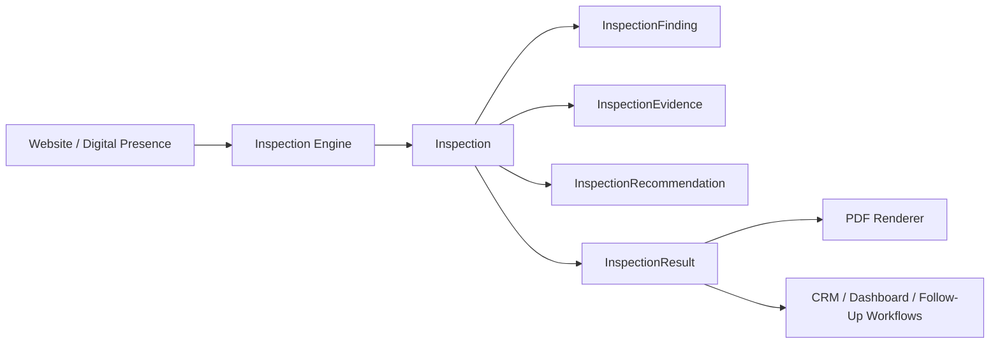
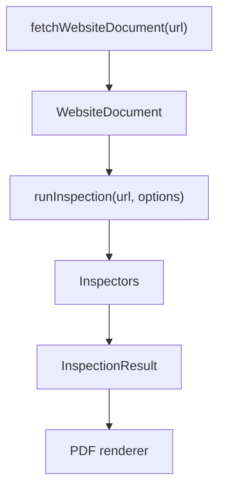
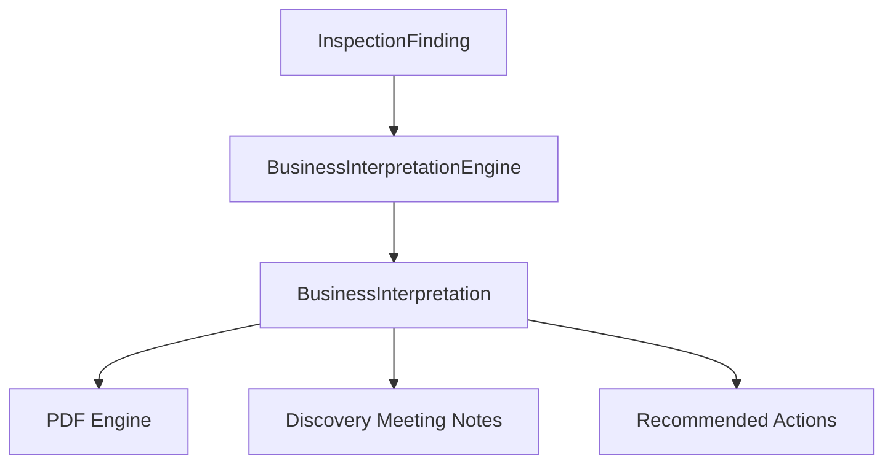
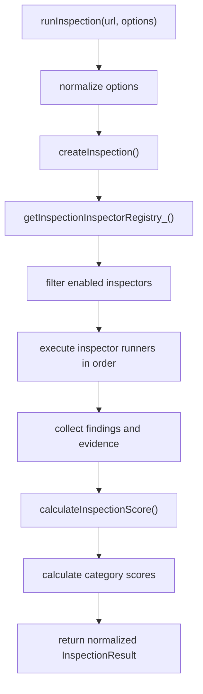
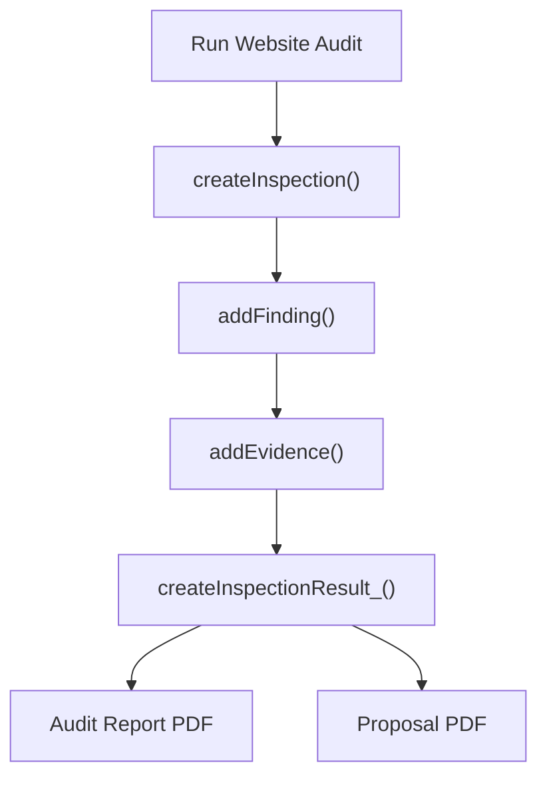

# Rogers Holdings OS Inspection Engine

Date: 2026-06-28

Status: Initial architecture module. Existing audit scoring, PDF generation, Gmail workflows, Drive routing, dashboards, menus, branding, and sheet structure are unchanged.

## Purpose

The Inspection Engine separates inspection from report generation.

Current state:

- Existing audit workflows still produce audit data and PDFs the same way.
- `PdfEngine.gs` remains the presentation layer.
- `InspectionEngine.gs` introduces reusable objects and helpers for future structured inspections.
- `InspectionOrchestrator.gs` provides the central `runInspection(url, options)` entrypoint for coordinating inspectors.

Target state:

1. Inspection Engine discovers findings.
2. Inspection Engine collects evidence.
3. Inspection Engine assigns severity, priority, difficulty, and expected ROI.
4. Inspection Engine produces structured observations and recommendations.
5. PDF renderer consumes `InspectionResult` and renders the presentation.

## Architecture



The first version is intentionally non-invasive. No current workflow calls the Inspection Engine yet.

## Website Fetch Engine

File:

- `WebsiteFetchEngine.gs`

Public entrypoint:

- `fetchWebsiteDocument(url, options)`

Purpose:

Fetch and normalize a business website into one reusable `WebsiteDocument` object. Inspectors can later analyze the same structured website data instead of each inspector fetching or parsing independently.

Current integration:

- Available in the developer-only Inspection Playground.
- Not used by production audit workflows.
- Not used by PDFs.
- Not used by proposal generation.
- Not used by Gmail workflows.

### WebsiteDocument Schema

Fields:

- `objectType`
- `version`
- `originalUrl`
- `finalUrl`
- `fetchStatus`
- `statusCode`
- `fetchedAt`
- `rawHtml`
- `visibleText`
- `pageTitle`
- `metaDescription`
- `headings`
- `links`
- `navigationLinks`
- `footerLinks`
- `images`
- `buttons`
- `forms`
- `phoneNumbers`
- `emails`
- `possibleAddresses`
- `scripts`
- `stylesheets`
- `warnings`
- `errors`
- `executionMetadata`

### Parser Capabilities

The first parser version extracts:

- page title
- meta description
- visible text with scripts/styles removed
- headings `h1` through `h6`
- links
- navigation links
- footer links
- images
- buttons
- forms and basic fields
- phone numbers
- email addresses
- possible street addresses
- scripts
- stylesheets
- redirect metadata
- fetch warnings and errors

### How Inspectors Will Use WebsiteDocument

Future inspectors should accept a `WebsiteDocument` through inspection options or evidence and read from normalized fields such as:

- `visibleText`
- `headings`
- `links`
- `navigationLinks`
- `footerLinks`
- `images`
- `buttons`
- `forms`
- `phoneNumbers`
- `emails`
- `possibleAddresses`

The long-term architecture is:



The WebsiteDocument should become the common source of website facts. The PDF renderer should continue rendering structured inspection output rather than fetching or parsing websites directly.

### Apps Script Fetching Limitations

Apps Script fetching has practical limits:

- JavaScript-rendered content may not appear in `rawHtml`.
- Some websites block server-side requests or bot-like user agents.
- Cookie banners, geo-routing, WAFs, and redirects may alter results.
- Apps Script does not provide a browser DOM.
- Apps Script does not capture screenshots.
- Apps Script does not run Lighthouse or PageSpeed by itself.
- HTML parsing is regex-based in this version and intentionally basic.

These limitations are expected. The engine is designed to capture reliable baseline signals and provide a future handoff point for stronger AI/browser tooling.

### Future Screenshot / OCR / PageSpeed Roadmap

Future modules can enrich WebsiteDocument or attach evidence objects for:

- desktop screenshot capture
- mobile screenshot capture
- OCR over screenshots
- Google Business Profile inspection
- PageSpeed metrics
- competitor comparison
- AI business interpretation
- recommendation generation

## Business Interpretation Engine

File:

- `BusinessInterpretationEngine.gs`

Public compatibility entrypoint:

- `generateBusinessInterpretation(prospect, reportFile)`

Internal core entrypoint:

- `generateBusinessInterpretationCore_(input)`

Purpose:

Convert technical inspection findings into executive-level consulting language while running in parallel with existing report wording. The engine explains why a finding matters, how it affects the business, how it affects customers, what should be done, and why that recommendation matters.

Current integration:

- `PdfEngine.gs` keeps the existing public `generateBusinessInterpretation(prospect, reportFile)` wrapper for compatibility.
- The wrapper delegates to `generateBusinessInterpretationCore_()` when available.
- Existing PDF wording is not replaced yet.
- Existing audit scoring, proposal generation, Gmail workflows, Drive routing, dashboards, menus, branding, and sheet structure are unchanged.

### BusinessInterpretation Object

Fields:

- `objectType`
- `findingId`
- `findingTitle`
- `executiveSummary`
- `businessImpact`
- `customerImpact`
- `riskLevel`
- `opportunityLevel`
- `revenueOpportunity`
- `trustOpportunity`
- `visibilityOpportunity`
- `customerExperienceOpportunity`
- `recommendedAction`
- `estimatedDifficulty`
- `expectedRoi`
- `confidence`
- `consultantNotes`

### Core Interpretation Helpers

- `generateBusinessInterpretationCore_()`
- `generateExecutiveBusinessSummary_()`
- `generateBusinessImpactNarrative_()`
- `generateCustomerImpactNarrative_()`
- `generateOpportunityStatement_()`
- `generateRecommendationNarrative_()`
- `generateExecutiveNarrative_()`
- `generateMeetingTalkingPoints_()`

### Relationship To Inspection Engine

The Inspection Engine discovers structured findings and evidence. The Business Interpretation Engine translates those findings into business language suitable for executive summaries, meeting prep, and future customer-facing PDFs.

Future flow:



### Consulting Style

The engine should write like a senior business consultant:

- professional
- helpful
- objective
- evidence-driven
- business-focused

It should avoid:

- technical wording when plain business language is better
- generic statements
- fear-based sales language
- language that shames the client

Example:

Instead of `No H1 tag detected`, the interpretation should explain that the homepage may not immediately communicate the company’s primary service, which can make it harder for new visitors to understand what the business offers.

### Future AI Opportunities

Future AI modules can improve interpretations by adding:

- industry-specific interpretation
- screenshot-aware business commentary
- customer persona-specific language
- competitor comparison context
- meeting-specific talking points
- recommendation sequencing by effort and ROI

## Inspection Orchestrator

File:

- `InspectionOrchestrator.gs`

Public entrypoint:

- `runInspection(url, options)`

Purpose:

Coordinate all registered inspectors and return one normalized `InspectionResult`.

Responsibilities:

- Create a new `Inspection` object.
- Read the inspector registry.
- Execute enabled inspectors in defined order.
- Merge all inspector findings into one inspection.
- Calculate the overall inspection score.
- Generate the overall grade.
- Build category scores.
- Build the priority matrix.
- Generate the business summary.
- Return one normalized `InspectionResult`.

### Orchestration Flow



### Inspector Registry

The registry is metadata-driven. Each inspector entry contains:

- `name`
- `key`
- `category`
- `version`
- `enabled`
- `description`
- `order`
- `runner`
- `metadata`

Default registered inspectors:

- Contact Information Inspector
- Homepage Inspector
- Trust Signals Inspector
- Calls To Action Inspector
- Local SEO Inspector
- Google Business Inspector
- Performance Inspector
- Accessibility Inspector
- Security Inspector
- Lead Capture Inspector
- Analytics Inspector
- Brand Consistency Inspector
- Content Quality Inspector

Contact Information Inspector and Homepage Inspector are currently runnable. Future inspectors can be added by registering metadata with a runner function.

Future extension options:

- Pass custom inspectors through `runInspection(url, { inspectors: [...] })`.
- Add a project-level `getCustomInspectionInspectors_()` function that returns inspector metadata.
- Enable/disable inspectors with `enabledInspectors`, `onlyInspectors`, `disabledInspectors`, or `skipInspectors`.

Example:

```js
const result = runInspection('https://example.com', {
  company: 'Example Company',
  enabledInspectors: ['contact-information'],
  text: 'Homepage text...',
  headerText: 'Call 859-404-7300',
  links: [{ text: 'Contact', href: '/contact' }]
});
```

## Objects

### Inspection

The top-level inspection record.

Fields:

- `objectType`
- `id`
- `version`
- `createdAt`
- `updatedAt`
- `company`
- `website`
- `city`
- `state`
- `industry`
- `source`
- `status`
- `categories`
- `findings`
- `evidence`
- `recommendations`
- `score`
- `priorityMatrix`
- `businessSummary`
- `inspectorNotes`
- `aiNotes`
- `metadata`

### InspectionCategory

Reusable category definition.

Initial categories:

- Contact Information
- Trust Signals
- Calls To Action
- Homepage
- Navigation
- Local SEO
- Google Business
- Performance
- Accessibility
- Content Quality
- Brand Consistency
- Lead Capture
- Analytics
- Security

### InspectionFinding

Structured finding object.

Fields:

- `id`
- `category`
- `title`
- `description`
- `severity`
- `priority`
- `status`
- `evidence`
- `businessImpact`
- `customerImpact`
- `recommendation`
- `difficulty`
- `expectedRoi`
- `inspectorNotes`
- `aiNotes`

### InspectionEvidence

Evidence object designed for screenshots, text, metrics, Search/GBP/PageSpeed data, or future AI-populated proof.

Fields:

- `id`
- `type`
- `source`
- `sourceUrl`
- `label`
- `description`
- `value`
- `screenshotUrl`
- `screenshotDataUri`
- `annotations`
- `capturedAt`
- `confidence`
- `metadata`

### InspectionRecommendation

Recommended action tied to a finding or inspection.

Fields:

- `id`
- `summary`
- `action`
- `rationale`
- `expectedOutcome`
- `owner`
- `timeframe`
- `metadata`

### InspectionResult

Final structured result intended for future rendering and workflow handoff.

Fields:

- `inspectionId`
- `company`
- `website`
- `score`
- `status`
- `summary`
- `findings`
- `evidence`
- `recommendations`
- `generatedAt`
- `metadata`

The orchestrator-normalized result also includes:

- `overallScore`
- `overallGrade`
- `priorityMatrix`
- `businessSummary`
- `categoryScores`
- `inspectorResults`
- `executionMetadata`

## Helper Functions

Public helpers:

- `createInspection(input)`
- `addFinding(inspection, findingInput)`
- `addEvidence(target, evidenceInput)`
- `calculateInspectionScore(inspection)`
- `getPriorityMatrix()`
- `getBusinessSummary(inspection)`
- `runInspection(url, options)`

Internal helpers:

- `getInspectionCategories_()`
- `createInspectionCategory_()`
- `createInspectionFinding_()`
- `createInspectionEvidence_()`
- `createInspectionRecommendation_()`
- `createInspectionResult_()`
- `resolveInspectionPriority_()`
- `normalizeInspectionCategory_()`
- `normalizeInspectionSeverity_()`
- `normalizeInspectionDifficulty_()`
- `normalizeInspectionExpectedRoi_()`
- `getInspectionInspectorRegistry_()`
- `getEnabledInspectionInspectors_()`
- `normalizeInspectionResult_()`
- `calculateInspectionCategoryScores_()`
- `collectInspectionEvidence_()`
- `getInspectionGrade_()`

## Production Inspectors

### Contact Information Inspector

File:

- `ContactInformationInspector.gs`

Public entrypoint:

- `inspectContactInformation(input)`

Purpose:

Inspect contact accessibility from supplied website artifacts and produce structured `InspectionFinding` objects. This inspector does not fetch or crawl websites. It analyzes provided text, HTML, link data, form data, header text, footer text, above-the-fold text, and optional evidence objects.

Supported input fields:

- `inspection`
- `prospect`
- `website`
- `html`
- `pageHtml`
- `text`
- `pageText`
- `homepageText`
- `aboveFoldText`
- `headerText`
- `footerText`
- `links`
- `forms`
- `evidence`
- `reportFile`
- `sourceUrl`

Implemented checks:

- Phone number present
- Phone number above the fold
- Click-to-call links
- Email address
- Contact page
- Contact form
- Business hours
- Physical address
- Footer contact info
- Header contact info

Finding output:

Each generated finding uses the existing `InspectionFinding` structure:

- exact issue
- severity
- priority
- business impact
- customer impact
- recommendation
- difficulty
- expected ROI
- supporting evidence when available
- inspector notes
- metadata identifying `Contact Information Inspector`

Example exact finding:

> Phone number was not detected in the website header.

Guardrail:

The inspector should not produce generic wording when exact evidence exists. If it detects a phone number but not in the supplied header/above-fold content, it names that condition directly instead of saying contact visibility could be improved.

### Homepage Inspector

File:

- `HomepageInspector.gs`

Public entrypoint:

- `inspectHomepage(input)`

Purpose:

Inspect first impression, homepage clarity, hero messaging, service clarity, first-screen calls to action, and above-the-fold customer understanding. This inspector does not fetch or crawl websites. It evaluates supplied HTML, homepage text, first-screen text, mobile first-screen text, heading data, link/button data, image data, and optional evidence objects.

Supported input fields:

- `inspection`
- `prospect`
- `website`
- `html`
- `pageHtml`
- `text`
- `pageText`
- `homepageText`
- `aboveFoldText`
- `firstScreenText`
- `mobileFirstScreenText`
- `heroHeadline`
- `heroText`
- `heroSubheadline`
- `headerText`
- `links`
- `buttons`
- `images`
- `headings`
- `forms`
- `evidence`
- `reportFile`
- `sourceUrl`

Implemented checks:

- Company name visibility
- Logo presence
- Hero headline clarity
- Supporting hero text
- Primary service clarity
- Service area visibility
- Primary call-to-action presence
- Secondary call-to-action presence
- Trust signal in first screen
- Contact option in first screen
- Homepage clutter
- Generic wording
- Mobile first-screen clarity
- Readability
- Broken or weak first impression signals

Finding output:

Each generated finding uses the existing `InspectionFinding` structure:

- exact issue title
- description
- severity
- priority
- business impact
- customer impact
- recommendation
- difficulty
- expected ROI
- supporting evidence
- inspector metadata identifying `Homepage Inspector`
- confidence score stored in finding metadata and evidence

Example exact findings:

> The homepage does not clearly explain the primary service in the first screen.

> No primary call-to-action was detected in the hero section.

> The service area is not clearly visible on the homepage.

Guardrail:

The inspector should not produce generic findings when exact evidence exists. If supplied evidence is incomplete or weak, the inspector lowers the confidence score instead of overstating certainty.

Inspection Playground test path:

1. Enable Developer Mode in Settings.
2. Open `Rogers Holdings OS > Development > Inspection Playground`.
3. Enter a Website URL.
4. Select `Homepage`.
5. Paste homepage or first-screen text into Optional Page Text.
6. Run Selected Inspector.
7. Review Inspector Results, Structured JSON Output, Category Scores, and Priority Matrix.

## How PDFs Will Consume Inspection Results

Future PDF flow:



The PDF renderer should not inspect websites directly. It should receive an `InspectionResult` and render:

- executive briefing
- findings
- evidence
- business impact
- recommendations
- next steps

## Future Roadmap

### Phase 1: Passive Integration

- Generate `InspectionResult` alongside existing audit output.
- Store structured inspection JSON in memory or Drive metadata.
- Continue rendering existing PDFs unchanged.

### Phase 2: PDF Consumption

- Update PDF helpers to read from `InspectionResult` when available.
- Keep backward compatibility with current prospect/report objects.

### Phase 3: AI Evidence Modules

Future AI modules can populate evidence without changing PDF rendering:

- website screenshots
- mobile screenshots
- Google Business observations
- PageSpeed results
- search result snapshots
- annotated evidence
- business interpretation

### Phase 4: CRM Feedback Loop

- Use structured findings to create follow-ups, project tasks, client deliverables, and dashboard insights.

## Future Inspector Roadmap

Recommended next inspectors:

1. Calls To Action Inspector
   - primary CTA visibility
   - button clarity
   - quote/request path
   - repeated CTA placement

2. Trust Signals Inspector
   - reviews
   - testimonials
   - certifications
   - project proof
   - guarantees

3. Local SEO Inspector
   - title tag
   - meta description
   - city/state language
   - service area clarity
   - local schema readiness

4. Google Business Inspector
   - profile link
   - NAP consistency
   - review visibility
   - map/location confidence

5. Lead Capture Inspector
   - form friction
   - fields required
   - quote/request flow
   - thank-you/confirmation path

6. Performance Inspector
   - PageSpeed metrics
   - load time
   - image weight
   - mobile performance

7. Accessibility Inspector
   - contrast
   - alt text
   - heading structure
   - keyboard/navigation basics

## Guardrails

- Do not replace current audit scoring until the Inspection Engine has been tested in parallel.
- Do not let PDF rendering own inspection/capture responsibilities.
- Do not let AI modules write directly into PDF HTML.
- Keep inspection objects plain and serializable.
- Preserve existing Rogers Holdings OS workflows during incremental adoption.
